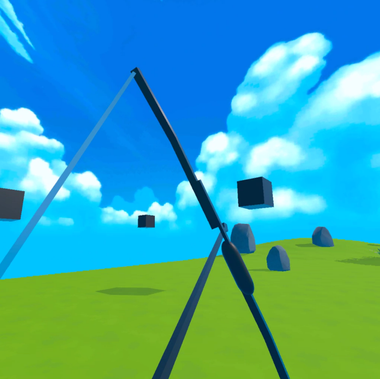
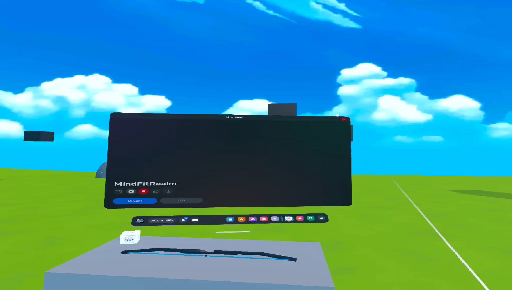

<div align="center">

# 🌿 **MindFit Realm**  
### **Mindful Escapism Through Immersive VR**  
### *A Unity XR wellness experience blending calm, focus, and cognitive rejuvenation*


<br>

[](/mnt/data/report.pdf)  
[](/mnt/data/presentation.pdf)

</div>

---

## 🌌 **Overview**

**MindFit Realm** is an immersive VR wellness experience built in **Unity + Meta XR**, designed to help users:

- 🧘 **Relax** through serene meditative environments  
- 🏹 **Sharpen focus** with precision-based VR archery  
- 🌤 **Escape stress** via mindful escapism and cognitive flow  
- 🎮 **Engage deeply** using physics-driven gameplay and spatial audio  

> A harmonious blend of **game design**, **mental wellness**, and **VR cognitive stimulation**, backed by research insights from the project’s report and presentation.

---

## 🧭 **Project Goals**
### 🌿 Mindfulness  
Create a calm, sensory-rich VR environment that encourages relaxation.
### 🎯 Focus Training  
Use archery as a meditative, precision-based practice to promote flow state.
### 🎨 Immersive Design  
Leverage Unity’s XR Interaction Toolkit to deliver intuitive, natural interactions.
### 🔮 Cognitive Wellness  
Blend entertainment, sensory immersion, and stress-reducing escape.

---

## 📁 **Project Structure**


<div>├─ README.md</div>
<div>├─ docs/</div>
<div>│   ├─ imgs/</div>
<div>│   │   ├─ hero.png</div>
<div>│   │   ├─ demo.png</div>
<div>│   │   ├─ archery.png</div>
<div>│   │   └─ start.png</div>
<div>│   ├─ report.pdf</div>
<div>│   └─ presentation.pdf</div>
<div>├─ Assets/</div>
<div>├─ Packages/</div>
<div>├─ ProjectSettings/</div>
<div>└─ ... (Unity project files)</div>

---

# 🎬 **Demo Glimpse**

<div align="center">



**“Arrows Fly. Minds Soar.”**

</div>

---

# 🎨 **Features**

### 🏹 **Archery Zone — Focus Through Flow**


- Precision-based bow mechanics  
- Physics-driven projectile motion  
- Target progression & adaptive difficulty  
- Natural two-hand interactions  

### 🍃 **Meditation Zone — Calm & Immersion**

- Serene landscapes  
- Soft dynamic lighting + realistic skyboxes  
- Spatial ambient audio  
- Smooth locomotion or static meditation mode  

### 🧩 **Modular Experience Design**

- Independent activity modules (Archery, Exploration, Relaxation)  
- Easy future expansion (yoga, puzzles, guided meditations)

---

## 💠 **System Architecture**

<div align="center">



</div>

**Core Components**
- **Gameplay Manager** – handles state transitions  
- **XR Interaction Toolkit** – gesture recognition & physics  
- **Procedural Environment** – trees, lighting, terrain  
- **Physics Engine** – linear projectile equations:

```math
x(t) = v₀ · t · cos(θ)\\
y(t) = v₀ · t · sin(θ) − ½gt²
```

## 🧪 Development Journey

1. Initial Setup
    ```text
    • Meta XR + Unity 2022 LTS
    • Compatibility troubleshooting
    • VR rig configuration and asset pipeline
    ```
2. Asset Integration
    ```text
    • Imported bow, target models
    • Re-designed environment (terrain, trees, sky)
    ```
3. C# Scripting
    ```text
    • Arrow spawning
    • Bowstring pull detection
    • Hit detection & scoring
    ```
4. Optimization
    ```text
    • Light baking
    • Level-of-Detail meshes
    • Reducing lag on Meta Quest
    ```

## 🚀 Installation & Setup
✔ Requirements
- Unity 2022 LTS
- Meta Quest 2 / 3 or Oculus Link
- Unity XR Interaction Toolkit
- Meta XR Plugin

### How to Run

1. `Clone` the repository 

    ```bash
    git clone https://github.com/kalpthakkar/MindFit-Realm.git
    ``` 

2. `Open` Unity Hub → Add Project → MindFit-Realm

3. `Build & Run` to Meta Quest (or use Link Mode)

4. `Enjoy` MindFit Realm 🌿

---

## 🔬 Algorithmic Innovations

1. Physics-Based Trajectory Simulation

2. Dynamic Difficulty Adjustment (DDA)

    🧬 Difficulty adjusts based on user performance:
    ```
    𝑁𝑒𝑤𝐷𝑖𝑓𝑓𝑖𝑐𝑢𝑙𝑡𝑦 = 𝐶𝑢𝑟𝑟𝑒𝑛𝑡𝐷𝑖𝑓𝑓𝑖𝑐𝑢𝑙𝑡𝑦 + 𝑘 ∗ (𝑃𝑙𝑎𝑦𝑒𝑟𝑆𝑐𝑜𝑟𝑒 − 𝐵𝑎𝑠𝑒𝑙𝑖𝑛𝑒)
    ```
    Metrics used:
    - <i>Hit accuracy</i>
    - <i>Time to release</i>
    - <i>Target streaks</i>

3. Procedural Environment

    <div>• &nbsp Perlin noise terrain</div>
    <div>• &nbsp Randomized asset </div>
    <div>• &nbsp Dynamic skyboxes & ambient audio</div>
    <br/>

4. (Future) Biometric Adaptation
    <div>• &nbsp Heart rate</div>
    <div>• &nbsp Breathing cues</div>
    <div>• &nbsp Mood-adaptive lighting & sound</div>
    <br/>

---

## 🌈 Experience Highlights
🧘 Relaxation Metrics
- `85%` users found the environment “relaxing & immersive”
- `80%` said archery felt “realistic & engaging”
- `90%` would use it for stress relief

⚡ Ultra-Responsive Interaction
- `20 ms` median input latency
- `90 FPS` rendering achieved

🎯 Engagement Boost
- Smooth bow mechanics
- Dynamic targets
- Cognitive load balanced gameplay

🎯 Results:
- ⭐ Immersion: `4.7 / 5`
- ⭐ Ease of Use: `4.5 / 5`
- ⭐ Relaxation: `4.8 / 5`
- ⭐ Cognitive Engagement: `4.6 / 5`


## 📊 Comparative Benchmarking

MindFit Realm was compared with popular VR apps like TRIPP VR, Nature Treks, and The Lab (Longbow).

| Feature                 | MindFit Realm | TRIPP | The Lab |
| ----------------------- | ------------- | ----- | ------- |
| Meditation              | ✅             | ⭐⭐⭐⭐⭐ | ❌       |
| Archery Skill           | ⭐⭐⭐⭐          | ❌     | ⭐⭐⭐⭐⭐   |
| Mental Wellness Focus   | ⭐⭐⭐⭐⭐         | ⭐⭐⭐⭐⭐ | ❌       |
| Physics Accuracy        | ⭐⭐⭐⭐⭐         | ❌     | ⭐⭐⭐⭐    |
| Procedural Environments | ⭐⭐⭐⭐          | ⭐⭐⭐   | ❌       |
|                         |               |       |         |

---

## 🧩 Limitations
- No multiplayer (yet)
- No native biometric integration
- Limited activity variety in current version

## 🚀 Future Roadmap
- 🤝 Multiplayer collaborative mindfulness
- 🩺 Biometric-driven ambient modulation (HRV, EEG)
- 🧘 Additional modules: guided meditation, breathwork
- 🎮 Puzzle-based cognitive activities
- 🪄 Advanced procedural generation

---

## 💬 Frequently Asked Questions (FAQ)

**🌿 What is the purpose of MindFit Realm?**
<br>
To merge mindfulness with interactive gameplay, creating a VR solution for mental clarity and relaxation.

**🏹 Why archery?**
<br>
Archery is a proven cognitive exercise that improves focus, precision, and flow-state immersion.

**🎧 Does it support spatial audio?**
<br>
Yes, nature ambience, environmental cues, and motion-synced sounds enhance immersion.

**🧩 Can more activities be added?**
<br>
Absolutely. The system is modular and supports easy expansion.

**🕶 What hardware does it run on?**
<br>
Developed for Meta Quest 2 but extensible to others.


## 🧾 Citations & References

<i>See full bibliography in this [report](/docs/report.pdf)</i>

---

## 📞 Contact

For any inquiries or support, please contact:

- **Kalp Thakkar** - [kalpthakkar2001@gmail.com](mailto:kalpthakkar2001@gmail.com)
- **GitHub**: [kalpthakkar](https://github.com/kalpthakkar)
- **LinkedIn**: [kalpthakkar](https://www.linkedin.com/in/kalpthakkar)

---

<p align="center"><strong>✨ MindFit Realm — A New Era of Virtual Wellbeing ✨</strong></p> <p align="center"><i>A calm mind, an immersive world, an uplifting escape.</i></p>
